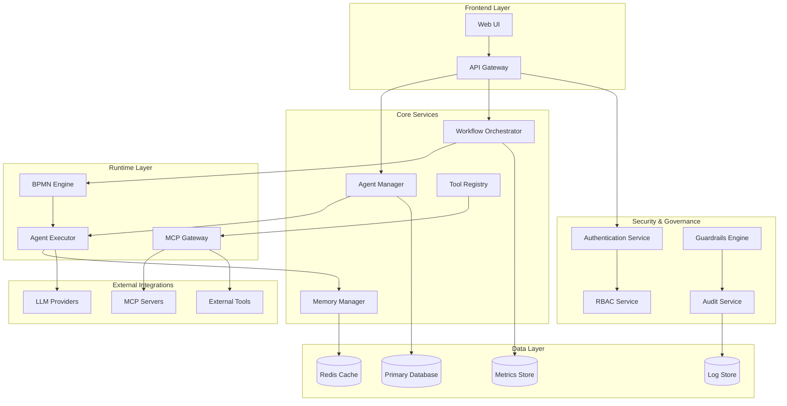

# AI Agent Framework Design Document

## Overview

The AI Agent Framework is designed as a comprehensive, enterprise-grade platform that enables semi-technical developers to create, orchestrate, and deploy AI agents with minimal complexity while maintaining professional-grade capabilities. The framework follows a microservices architecture with event-driven communication, providing scalability, maintainability, and flexibility for various deployment scenarios.

The system is built around five core principles:
1. **Simplicity First**: Complex AI capabilities exposed through intuitive interfaces
2. **Security by Design**: Multi-layered security with guardrails at every level
3. **Enterprise Ready**: RBAC, audit trails, and compliance features built-in
4. **Deployment Flexibility**: From Docker Compose to Kubernetes to cloud-native
5. **Extensibility**: Plugin architecture for tools, MCP servers, and custom integrations

## Architecture

### High-Level Architecture

The framework employs a distributed microservices architecture with the following key components:



### Technology Stack Licensing Analysis

**✅ Completely Free & Commercial-Friendly:**

**Frontend Layer:**
- **React 18+**: MIT License - ✅ Free for commercial use
- **TypeScript**: Apache 2.0 - ✅ Free for commercial use
- **Material-UI**: MIT License - ✅ Free for commercial use
- **React Query**: MIT License - ✅ Free for commercial use
- **React Flow**: MIT License - ✅ Free for commercial use
- **Monaco Editor**: MIT License - ✅ Free for commercial use
- **Kong Gateway Community**: Apache 2.0 - ✅ Free for commercial use
- **Nginx**: BSD-2-Clause - ✅ Free for commercial use

**Core Services (Python Stack):**
- **Python**: PSF License - ✅ Free for commercial use
- **FastAPI**: MIT License - ✅ Free for commercial use
- **SQLAlchemy**: MIT License - ✅ Free for commercial use
- **Pydantic**: MIT License - ✅ Free for commercial use
- **Redis**: BSD-3-Clause - ✅ Free for commercial use

**Data & Storage:**
- **PostgreSQL**: PostgreSQL License (BSD-style) - ✅ Free for commercial use
- **PgBouncer**: ISC License - ✅ Free for commercial use
- **Chroma**: Apache 2.0 - ✅ Free for commercial use
- **Docker**: Apache 2.0 (Community Edition) - ✅ Free for commercial use

**Security & Auth:**
- **Keycloak**: Apache 2.0 - ✅ Free for commercial use
- **Casbin**: Apache 2.0 - ✅ Free for commercial use
- **python-jose**: MIT License - ✅ Free for commercial use

**Monitoring:**
- **Prometheus**: Apache 2.0 - ✅ Free for commercial use
- **Grafana**: AGPL v3 - ⚠️ **POTENTIAL ISSUE** (see below)

**⚠️ Licensing Considerations:**

**Grafana (AGPL v3):**
- **Issue**: AGPL requires you to provide source code if you offer Grafana as a network service
- **Solution**: Use Grafana only for internal monitoring, not as part of customer-facing service
- **Alternative**: Replace with Apache Superset (Apache 2.0) or custom dashboards

**🔄 Recommended License-Safe Alternatives:**

```python
# Replace Grafana with Apache Superset
MONITORING_STACK = {
    "metrics_collection": "Prometheus",  # Apache 2.0
    "visualization": "Apache Superset",  # Apache 2.0
    "alerting": "Prometheus Alertmanager"  # Apache 2.0
}
```

**⚠️ Phase 2 Considerations:**

**Camunda Platform 8:**
- **Community Edition**: Apache 2.0 - ✅ Free
- **Enterprise Edition**: Commercial license required for advanced features
- **Monetization Impact**: Community edition sufficient for most use cases

**Cloud Services (Phase 2):**
- **OpenAI API**: Pay-per-use - ✅ No licensing issues
- **Anthropic Claude**: Pay-per-use - ✅ No licensing issues
- **Pinecone**: Freemium with paid tiers - ✅ No licensing issues

**✅ Monetization-Safe Technology Stack:**

```yaml
# Completely safe for commercial products
frontend:
  - React (MIT)
  - TypeScript (Apache 2.0)
  - Material-UI (MIT)

backend:
  - Python (PSF)
  - FastAPI (MIT)
  - SQLAlchemy (MIT)
  - PostgreSQL (PostgreSQL License)
  - Redis (BSD-3)

security:
  - Keycloak (Apache 2.0)
  - Casbin (Apache 2.0)

monitoring:
  - Prometheus (Apache 2.0)
  - Apache Superset (Apache 2.0)  # Instead of Grafana

containerization:
  - Docker CE (Apache 2.0)
  - Docker Compose (Apache 2.0)
```

**💰 Monetization Strategy Recommendations:**

1. **SaaS Model**: All chosen technologies support SaaS deployment
2. **On-Premises Sales**: All licenses allow redistribution
3. **White-Label Solutions**: No licensing restrictions
4. **Enterprise Features**: Can add commercial features on top of open-source base
5. **Support & Services**: Can monetize support and professional services

**🚨 Technologies to Avoid for Commercial Products:**
- **GPL/AGPL Licensed Software**: Requires source code disclosure
- **Copyleft Licenses**: May require derivative works to be open source
- **Restrictive Commercial Licenses**: Limit monetization options

**✅ Final Recommendation:**
Replace Grafana with Apache Superset, and all technology choices will be completely safe for commercial monetization with no licensing restrictions.

**Frontend Layer:**
- **Web UI**: 
  - **VS Code-style Interface Architecture:**
    - **Activity Bar**: Navigation for Agents, Workflows, Tools, Monitoring, Settings
    - **Side Panel**: Explorer-style tree view for project structure and resources
    - **Main Editor Area**: Tabbed interface for agent configuration, BPMN design, code editing
    - **Terminal Panel**: Integrated logs, debugging output, agent execution monitoring
    - **Status Bar**: System health indicators, active agents, deployment status
  - **Technology Stack:**
    - React 18+ with TypeScript for type safety
    - **Monaco Editor**: Full VS Code editor experience for code editing
    - **React Flow**: Visual BPMN workflow designer with drag-and-drop
    - **Material-UI or Ant Design**: Consistent component library
    - **React Query**: State management and API caching
    - **React Split Pane**: Resizable panels like VS Code
  - **Workspace Concepts:**
    - **Agent Workspace**: Dedicated space for agent development and testing
    - **Workflow Workspace**: BPMN design and orchestration environment  
    - **Tools Workspace**: Custom tool development and MCP server integration
    - **Monitoring Workspace**: System observability and debugging
- **API Gateway**: 
  - Kong Gateway for enterprise features
  - Alternative: AWS API Gateway or Azure API Management for cloud deployments
  - Nginx for load balancing and SSL termination

**Core Services:**
- **Programming Language**: Python with FastAPI for all core services
- **Agent Manager**: 
  - FastAPI for REST APIs
  - Pydantic for input validation and data models
  - SQLAlchemy for database ORM
- **Workflow Orchestrator**: 
  - Camunda Platform 8 (Community Edition) for BPMN execution
  - Phase 2: Zeebe for cloud-native deployments
  - Apache Kafka (Phase 2) or Redis Pub/Sub for event streaming
- **Tool Registry**: 
  - FastAPI with plugin architecture
  - Docker for tool containerization
  - Phase 2: Kubernetes for tool execution isolation
- **Memory Manager**: 
  - Pinecone (Phase 2) or Weaviate for vector storage
  - Sentence Transformers for local embeddings
  - Redis for caching frequently accessed memories

**Security & Governance:**
- **Authentication Service**: 
  - Keycloak (self-hosted) for identity management
  - Phase 2: Auth0 for managed service option
  - JWT with RS256 signing
  - python-jose for token handling
- **RBAC Service**: 
  - Casbin for policy enforcement
  - PostgreSQL for role/permission storage
  - Redis for permission caching
- **Guardrails Engine**: 
  - Custom ML models with TensorFlow/PyTorch
  - Phase 2: OpenAI Moderation API integration
  - Local content filtering rules
- **Audit Service**: 
  - PostgreSQL for audit log storage
  - Phase 2: Elasticsearch for advanced search
  - Python logging framework with structured output

**Runtime Layer:**
- **Agent Executor**: 
  - Docker containers for agent isolation
  - Phase 2: Kubernetes for orchestration and scaling
  - **Inter-service Communication Options:**
    - **gRPC**: Excellent Python support with `grpcio` and `grpcio-tools` (Google-maintained)
    - **Alternative**: REST APIs with FastAPI (HTTP/JSON)
    - **Alternative**: Message queues with Redis Pub/Sub or Celery
- **BPMN Engine**: 
  - Camunda Platform 8 Community Edition
  - FastAPI (Python) for service layer
  - Phase 2: GraphQL for flexible API queries
- **MCP Gateway**: 
  - Python for MCP protocol implementation
  - WebSocket support for real-time communication
  - JSON for serialization (Phase 2: Protocol Buffers)

**Data Layer:**
- **Primary Database**: 
  - PostgreSQL 15+ for ACID compliance
  - Connection pooling with PgBouncer
  - Phase 2: Read replicas for query performance
- **Cache**: 
  - Redis 7+ for caching and session management
  - Phase 2: Redis Cluster for high availability
  - Redis Streams for event sourcing
- **Vector Database**: 
  - Chroma for development and initial deployment
  - Phase 2: Pinecone for managed vector search
  - Phase 2: Weaviate for self-hosted production deployments
- **Log Store**: 
  - File-based logging with rotation
  - Phase 2: Elasticsearch for log aggregation
  - Phase 2: S3/MinIO for long-term log retention
- **Metrics Store**: 
  - Prometheus for metrics collection
  - Apache Superset for visualization and dashboards
  - Prometheus Alertmanager for alerting
  - Phase 2: InfluxDB for time-series data

**External Integrations:**
- **LLM Providers**: 
  - Local models with Ollama for initial deployment
  - Phase 2: OpenAI API (GPT-4, GPT-3.5)
  - Phase 2: Anthropic Claude API
  - Phase 2: Azure OpenAI Service
- **Message Queue**: 
  - Redis Pub/Sub for lightweight messaging
  - Phase 2: Apache Kafka for high-throughput messaging
  - Phase 2: RabbitMQ alternative option
- **Container Runtime**: 
  - Docker for containerization
  - Phase 2: containerd for Kubernetes environments
  - Phase 2: Podman for rootless containers

**Development & Deployment:**
- **Build Tools**: 
  - Webpack/Vite for frontend bundling
  - Docker multi-stage builds for services
  - GitHub Actions or GitLab CI for CI/CD
- **Infrastructure as Code**: 
  - Docker Compose for local and initial deployments
  - Phase 2: Terraform for cloud infrastructure
  - Phase 2: Helm charts for Kubernetes deployments
- **Monitoring & Observability**: 
  - Python logging with structured output
  - Prometheus and Apache Superset for metrics and visualization
  - Phase 2: Jaeger for distributed tracing
  - Phase 2: OpenTelemetry for instrumentation
  - Phase 2: Sentry for error tracking

**Security Tools:**
- **Secrets Management**: 
  - Environment variables and Docker secrets for initial deployment
  - Phase 2: HashiCorp Vault for secret storage
  - Phase 2: Kubernetes Secrets for container secrets
- **Certificate Management**: 
  - Self-signed certificates for development
  - Let's Encrypt for production
  - Phase 2: cert-manager for Kubernetes
- **Vulnerability Scanning**: 
  - Basic dependency scanning with pip-audit
  - Phase 2: Snyk for comprehensive dependency scanning
  - Phase 2: Trivy for container image scanning

**Frontend Layer:**
- **Web UI**: React-based interface for agent creation, workflow design, and monitoring
- **API Gateway**: Kong with comprehensive security features including DDoS protection, rate limiting, authentication, input validation, and threat detection

**Core Services:**
- **Agent Manager**: CRUD operations for agents, templates, and configurations
- **Workflow Orchestrator**: BPMN workflow execution and state management
- **Tool Registry**: Management of custom tools and MCP server integrations
- **Memory Manager**: Agent memory storage, retrieval, and semantic search

**Security & Governance:**
- **Authentication Service**: JWT-based authentication with OAuth2/OIDC support
- **RBAC Service**: Role-based access control and permission management
- **Guardrails Engine**: Content filtering and safety validation
- **Audit Service**: Comprehensive logging and compliance tracking

**Runtime Layer:**
- **Agent Executor**: Agent lifecycle management and execution
- **BPMN Engine**: Camunda or similar for workflow execution
- **MCP Gateway**: Model Context Protocol implementation and external tool integration

### API Gateway Security Layer

The API Gateway serves as the primary security perimeter, implementing multiple layers of protection against external attacks:

**DDoS and Rate Limiting Protection:**
- **Adaptive Rate Limiting**: Dynamic rate limits based on user behavior and system load
- **IP-based Throttling**: Configurable limits per IP address with automatic blacklisting
- **Geographic Filtering**: Block or limit requests from specific countries/regions
- **Request Size Limits**: Prevent oversized payload attacks
- **Connection Limits**: Maximum concurrent connections per client

**Authentication and Authorization:**
- **Multi-factor Authentication**: Support for TOTP, SMS, and hardware tokens
- **JWT Token Validation**: Cryptographic signature verification with token expiration
- **OAuth2/OIDC Integration**: Enterprise SSO and identity provider integration
- **API Key Management**: Secure API key generation, rotation, and revocation
- **Session Management**: Secure session handling with automatic timeout

**Input Validation and Sanitization:**
- **Schema Validation**: Strict JSON/XML schema enforcement for all endpoints
- **SQL Injection Prevention**: Parameterized query enforcement and input sanitization
- **XSS Protection**: Content Security Policy headers and input encoding
- **CSRF Protection**: Token-based CSRF prevention for state-changing operations
- **File Upload Security**: Virus scanning, file type validation, and size limits

**Network Security:**
- **TLS/SSL Termination**: Strong cipher suites and certificate management
- **HSTS Headers**: HTTP Strict Transport Security enforcement
- **IP Whitelisting**: Allow-list for trusted IP ranges and networks
- **VPN Integration**: Support for corporate VPN and private network access
- **WAF Integration**: Web Application Firewall for advanced threat detection

**Monitoring and Threat Detection:**
- **Real-time Monitoring**: Request pattern analysis and anomaly detection
- **Security Event Logging**: Comprehensive logging of security-relevant events
- **Intrusion Detection**: Automated detection of attack patterns and suspicious behavior
- **Alert System**: Real-time notifications for security incidents
- **Forensic Capabilities**: Detailed request/response logging for incident investigation

**API Security Best Practices:**
- **CORS Configuration**: Strict Cross-Origin Resource Sharing policies
- **HTTP Security Headers**: Comprehensive security header implementation
- **API Versioning**: Secure API version management and deprecation
- **Error Handling**: Secure error responses that don't leak system information
- **Audit Trail**: Complete API access logging with correlation IDs

## Components and Interfaces

**Responsibilities:**
- Agent lifecycle management (create, read, update, delete)
- Template framework provisioning
- Version control and rollback capabilities
- Agent registry maintenance

**Key Interfaces:**
```typescript
interface AgentManager {
  createAgent(template: AgentTemplate, config: AgentConfig): Promise<Agent>
  updateAgent(agentId: string, config: AgentConfig): Promise<Agent>
  deployAgent(agentId: string, environment: string): Promise<Deployment>
  getAgentVersions(agentId: string): Promise<AgentVersion[]>
  rollbackAgent(agentId: string, version: string): Promise<Agent>
}

interface AgentTemplate {
  id: string
  name: string
  type: 'chatbot' | 'content-generation' | 'data-analysis' | 'custom'
  agents: TemplateAgent[]
  connections: AgentConnection[]
  mcpServers: string[]
}
```

### Workflow Orchestrator Service

**Responsibilities:**
- BPMN workflow design and execution
- Agent coordination and state management
- Event-driven communication between agents
- Workflow monitoring and analytics

**Key Interfaces:**
```typescript
interface WorkflowOrchestrator {
  createWorkflow(bpmnXml: string, metadata: WorkflowMetadata): Promise<Workflow>
  executeWorkflow(workflowId: string, input: any): Promise<WorkflowExecution>
  pauseWorkflow(executionId: string): Promise<void>
  resumeWorkflow(executionId: string): Promise<void>
  getWorkflowStatus(executionId: string): Promise<WorkflowStatus>
}

interface BPMNEngine {
  deployProcess(bpmnXml: string): Promise<ProcessDefinition>
  startProcessInstance(processKey: string, variables: any): Promise<ProcessInstance>
  completeTask(taskId: string, variables: any): Promise<void>
}
```

### Memory Manager Service

**Responsibilities:**
- Agent memory storage and retrieval
- Semantic search capabilities
- Memory lifecycle management
- Context persistence across sessions

**Key Interfaces:**
```typescript
interface MemoryManager {
  storeMemory(agentId: string, memory: Memory): Promise<void>
  retrieveMemories(agentId: string, query: string, limit: number): Promise<Memory[]>
  semanticSearch(agentId: string, query: string): Promise<SearchResult[]>
  clearMemory(agentId: string, retentionPolicy: RetentionPolicy): Promise<void>
}

interface Memory {
  id: string
  agentId: string
  content: string
  metadata: Record<string, any>
  timestamp: Date
  importance: number
  embedding?: number[]
}
```

### Guardrails Engine

**Responsibilities:**
- Input validation and content filtering
- Output safety checks
- Policy enforcement
- Violation detection and reporting

**Key Interfaces:**
```typescript
interface GuardrailsEngine {
  validateInput(input: string, context: ValidationContext): Promise<ValidationResult>
  validateOutput(output: string, context: ValidationContext): Promise<ValidationResult>
  checkPolicy(action: string, resource: string, user: User): Promise<PolicyResult>
  reportViolation(violation: Violation): Promise<void>
}

interface ValidationResult {
  isValid: boolean
  violations: string[]
  sanitizedContent?: string
  riskScore: number
}
```

## Data Models

### Core Entities

**Agent:**
```typescript
interface Agent {
  id: string
  name: string
  description: string
  type: AgentType
  config: AgentConfig
  version: string
  status: AgentStatus
  createdBy: string
  createdAt: Date
  updatedAt: Date
  deployments: Deployment[]
}

interface AgentConfig {
  llmProvider: LLMProvider
  systemPrompt: string
  temperature: number
  maxTokens: number
  tools: string[]
  mcpServers: string[]
  memoryConfig: MemoryConfig
  guardrails: GuardrailConfig[]
}
```

**Workflow:**
```typescript
interface Workflow {
  id: string
  name: string
  description: string
  bpmnXml: string
  version: string
  status: WorkflowStatus
  agents: string[]
  variables: WorkflowVariable[]
  createdBy: string
  createdAt: Date
}

interface WorkflowExecution {
  id: string
  workflowId: string
  status: ExecutionStatus
  startTime: Date
  endTime?: Date
  input: any
  output?: any
  currentStep: string
  executionTrace: ExecutionStep[]
}
```

**User and RBAC:**
```typescript
interface User {
  id: string
  username: string
  email: string
  roles: Role[]
  permissions: Permission[]
  createdAt: Date
  lastLogin: Date
}

interface Role {
  id: string
  name: string
  description: string
  permissions: Permission[]
  isSystemRole: boolean
}

interface Permission {
  id: string
  resource: string
  action: string
  conditions?: Record<string, any>
}
```

### Database Schema Design

**Primary Database (PostgreSQL):**
- **agents**: Agent definitions and configurations
- **workflows**: BPMN workflows and metadata
- **executions**: Workflow execution history and state
- **users**: User accounts and authentication data
- **roles_permissions**: RBAC configuration
- **audit_logs**: Comprehensive audit trail
- **tools**: Custom tool definitions and metadata

**Cache Layer (Redis):**
- **agent_sessions**: Active agent execution state
- **workflow_state**: Current workflow execution context
- **user_sessions**: Authentication and session data
- **memory_cache**: Frequently accessed memory data

**Vector Database (Pinecone/Weaviate):**
- **agent_memories**: Semantic memory storage with embeddings
- **tool_descriptions**: Searchable tool and capability descriptions

## Correctness Properties

*A property is a characteristic or behavior that should hold true across all valid executions of a system-essentially, a formal statement about what the system should do. Properties serve as the bridge between human-readable specifications and machine-verifiable correctness guarantees.*

Before defining the correctness properties, let me analyze the acceptance criteria to determine which ones are testable through property-based testing.

<function_calls>
<invoke name="prework">
<parameter name="featureName">ai-agent-framework
Bas
ed on the prework analysis, I've identified the testable acceptance criteria and will now define the corresponding correctness properties. After reviewing all properties for redundancy, I can consolidate several related properties:

**Property Reflection:**
- Properties 1.4 and 8.5 both test persistence behavior - can be combined into a comprehensive persistence property
- Properties 4.1, 4.5, 16.1, 16.2, and 18.1 all test logging behavior - can be consolidated into comprehensive logging properties
- Properties 10.1 and 10.2 both test guardrails - can be combined into comprehensive input/output validation
- Properties 2.4 and 2.5 both test LLM integration - can be combined into LLM request/response handling

### Consolidated Correctness Properties

**Property 1: Template Configuration Completeness**
*For any* agent template selection, the resulting configuration should have all required fields populated with valid default values that pass validation
**Validates: Requirements 1.2**

**Property 2: Input Validation Consistency**
*For any* invalid input across the system, the framework should reject the input and provide appropriate feedback without accepting malformed data
**Validates: Requirements 1.3**

**Property 3: Data Persistence Round-Trip**
*For any* valid data (agent configurations, memory data, workflow state), storing and then retrieving should produce equivalent data that survives system restarts
**Validates: Requirements 1.4, 8.5**

**Property 4: Unique Identifier Generation**
*For any* system entity creation (agents, workflows, executions), generated identifiers should be unique and the entity should be discoverable through the system
**Validates: Requirements 1.5**

**Property 5: LLM Provider Integration**
*For any* LLM provider selection, the system should prompt for credentials, validate connections, and handle request/response cycles with proper authentication and parsing
**Validates: Requirements 2.2, 2.3, 2.4, 2.5**

**Property 6: Workflow Dependency Validation**
*For any* workflow configuration, the system should detect and prevent circular dependencies while allowing valid dependency chains
**Validates: Requirements 3.2**

**Property 7: Workflow Execution Ordering**
*For any* valid workflow, execution should follow the defined sequence with proper agent coordination and message passing
**Validates: Requirements 3.3, 3.4**

**Property 8: Execution Completeness**
*For any* completed workflow execution, the system should provide complete logs and results with all required information
**Validates: Requirements 3.5**

**Property 9: Comprehensive Logging**
*For any* system operation (agent execution, LLM interaction, workflow orchestration), all activities should be logged with timestamps, context, and structured metadata
**Validates: Requirements 4.1, 4.5, 16.1, 16.2, 18.1**

**Property 10: Error Handling Completeness**
*For any* error condition, the system should capture error details, provide debugging information, and maintain system stability
**Validates: Requirements 4.3**

**Property 11: Memory Storage and Retrieval**
*For any* information processing by agents, relevant data should be stored in memory and retrievable through semantic search with proper efficiency
**Validates: Requirements 8.1, 8.2**

**Property 12: Memory Management Intelligence**
*For any* agent reaching memory capacity, the system should retain important memories and remove less important ones based on defined criteria
**Validates: Requirements 8.3**

**Property 13: Conversation Continuity**
*For any* user interaction with agents, conversation history and preferences should be maintained and accessible across sessions
**Validates: Requirements 8.4**

**Property 14: Comprehensive Guardrails**
*For any* user input or agent output, the system should apply appropriate content filtering, safety checks, and policy enforcement
**Validates: Requirements 10.1, 10.2**

**Property 15: Access Control Enforcement**
*For any* resource access attempt, the system should enforce permission-based controls, rate limiting, and proper authorization
**Validates: Requirements 10.3, 15.2, 15.3, 15.4**

**Property 16: Security and Audit Integrity**
*For any* sensitive data processing or security event, the system should apply encryption, create audit logs, and maintain tamper-evident records
**Validates: Requirements 10.4, 10.5, 16.4**

**Property 17: Permission Update Immediacy**
*For any* role or permission modification, access controls should update immediately and all changes should be audited
**Validates: Requirements 15.5**

**Property 18: BPMN Compliance and Execution**
*For any* BPMN workflow, the system should support standard BPMN features, execute according to process flow, and export valid BPMN XML
**Validates: Requirements 12.2, 12.3, 12.5**

**Property 19: Agent Lifecycle Management**
*For any* agent placement in BPMN processes, the system should automatically handle lifecycle management and state transitions
**Validates: Requirements 12.4**

**Property 20: Deployment Package Completeness**
*For any* download or self-hosting request, generated packages should include all required components, dependencies, and deployment artifacts
**Validates: Requirements 13.1, 13.2**

**Property 21: Tool Integration Completeness**
*For any* custom tool or MCP server integration, the system should validate interfaces, handle authentication, and enable dynamic discovery and invocation
**Validates: Requirements 14.2, 14.3, 14.4, 14.5**

**Property 22: Audit Trail Completeness**
*For any* tool access or system interaction, all events should be audited with complete request/response logging and proper categorization
**Validates: Requirements 16.3**

**Property 23: API Gateway Security Enforcement**
*For any* external request to the API Gateway, the system should apply rate limiting, input validation, authentication checks, and threat detection before allowing access to internal services
**Validates: Requirements 10.3, 10.5**

**Property 24: Observability and Monitoring**
*For any* system operation, appropriate metrics should be collected, logs should support multiple formats, and distributed tracing should link related operations
**Validates: Requirements 18.2, 18.3, 18.4**

## Error Handling

The framework implements a comprehensive error handling strategy with multiple layers:

### Error Categories

**1. User Input Errors:**
- Invalid agent configurations
- Malformed BPMN workflows
- Authentication failures
- Permission violations

**2. System Errors:**
- Service unavailability
- Database connection failures
- Memory exhaustion
- Network timeouts

**3. Integration Errors:**
- LLM provider failures
- MCP server disconnections
- External API errors
- Tool execution failures

**4. Security Errors:**
- Guardrail violations
- Unauthorized access attempts
- Data encryption failures
- Audit log tampering

### Error Handling Patterns

**Circuit Breaker Pattern:**
- Prevents cascading failures in external integrations
- Automatic recovery and health checks
- Configurable failure thresholds

**Retry with Exponential Backoff:**
- Transient failure recovery
- Configurable retry policies
- Dead letter queues for persistent failures

**Graceful Degradation:**
- Fallback mechanisms for non-critical features
- Partial functionality maintenance
- User notification of reduced capabilities

**Error Propagation:**
- Structured error responses with correlation IDs
- Context preservation across service boundaries
- Comprehensive error logging and alerting

## Testing Strategy

The AI Agent Framework employs a dual testing approach combining unit testing and property-based testing to ensure comprehensive coverage and correctness validation.

### Property-Based Testing Framework

**Technology Choice:** We will use **Hypothesis** (Python) as our primary property-based testing library, configured to run a minimum of 100 iterations per property test to ensure thorough coverage of the input space.

**Property Test Implementation Requirements:**
- Each correctness property must be implemented by a single property-based test
- All property tests must be tagged with comments referencing the design document property
- Tag format: `**Feature: ai-agent-framework, Property {number}: {property_text}**`
- Tests must use intelligent generators that constrain inputs to valid domains
- No mocking in property tests - tests must validate real functionality

### Unit Testing Strategy

**Complementary Coverage:**
- Unit tests focus on specific examples, edge cases, and integration points
- Property tests verify universal properties across all valid inputs
- Together they provide comprehensive coverage: unit tests catch concrete bugs, property tests verify general correctness

**Unit Test Areas:**
- API endpoint behavior with specific payloads
- Database operations with known data sets
- Authentication flows with test credentials
- Error handling with specific failure scenarios
- UI component behavior with mock interactions

### Testing Infrastructure

**Test Environment:**
- Containerized test environment with Docker Compose
- Isolated test databases and message queues
- Mock external services for deterministic testing
- Automated test execution in CI/CD pipeline

**Test Data Management:**
- Factory pattern for test data generation
- Database seeding and cleanup automation
- Test data versioning and migration
- Synthetic data generation for privacy compliance

### Integration Testing

**Service Integration:**
- Contract testing between microservices
- End-to-end workflow testing
- Performance testing under load
- Security testing with penetration testing tools

**External Integration Testing:**
- LLM provider integration with test accounts
- MCP server compatibility testing
- Tool integration validation
- Deployment testing across environments#
## Service Responsibilities

**Frontend Layer:**
- **Web UI**: React-based interface for agent creation, workflow design, and monitoring
- **API Gateway**: Kong with comprehensive security features including DDoS protection, rate limiting, authentication, input validation, and threat detection

**Core Services:**
- **Agent Manager**: CRUD operations for agents, templates, and configurations
- **Workflow Orchestrator**: BPMN workflow execution and state management
- **Tool Registry**: Management of custom tools and MCP server integrations
- **Memory Manager**: Agent memory storage, retrieval, and semantic search

**Security & Governance:**
- **Authentication Service**: JWT-based authentication with OAuth2/OIDC support
- **RBAC Service**: Role-based access control and permission management
- **Guardrails Engine**: Content filtering and safety validation
- **Audit Service**: Comprehensive logging and compliance tracking

**Runtime Layer:**
- **Agent Executor**: Agent lifecycle management and execution
- **BPMN Engine**: Camunda or similar for workflow execution
- **MCP Gateway**: Model Context Protocol implementation and external tool integration