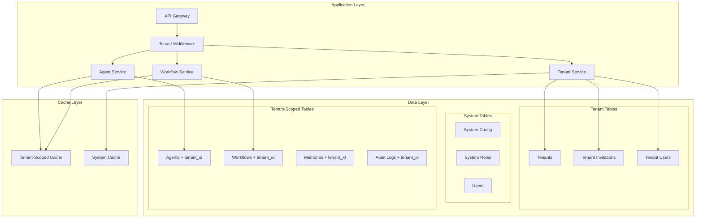
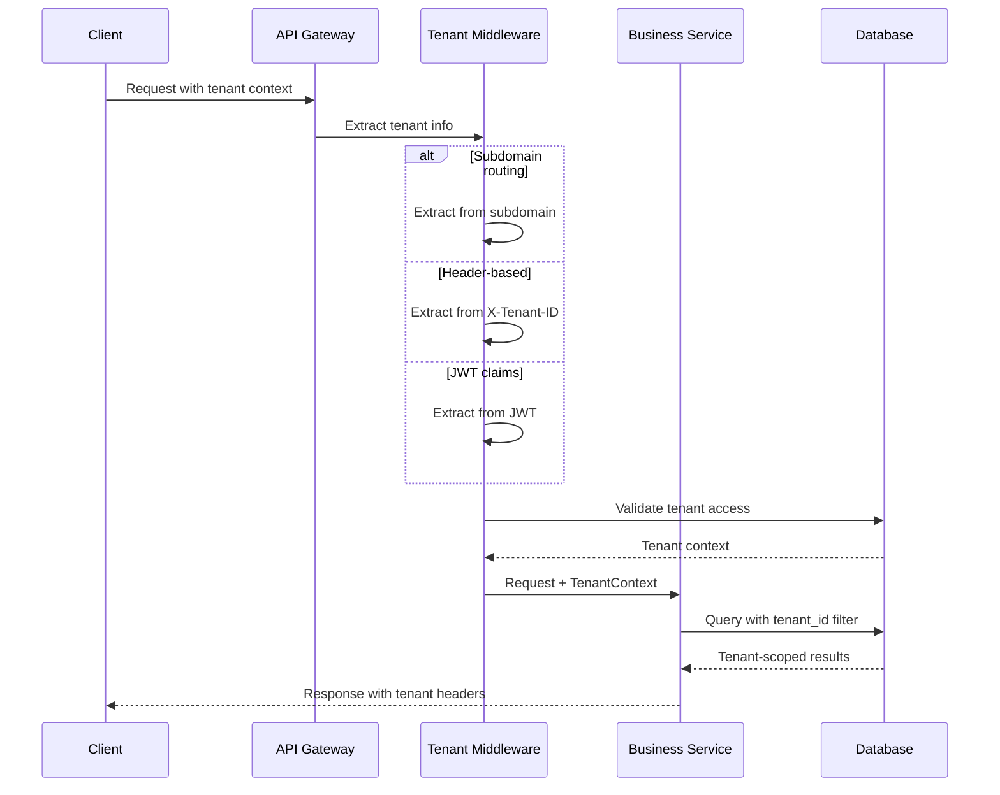

# Multi-Tenant Architecture Design Document

## Overview

The Multi-Tenant Architecture for the AI Agent Framework enables a single deployment to serve multiple organizations (tenants) while maintaining complete data isolation, security, and customization capabilities. This design supports SaaS deployments, enterprise multi-division scenarios, and managed service provider offerings.

The architecture implements a shared-infrastructure, isolated-data model where:
- **Infrastructure is shared** across tenants for cost efficiency and operational simplicity
- **Data is completely isolated** using row-level security and tenant-scoped queries
- **Configurations are tenant-specific** allowing customization and branding
- **Resources are quota-managed** ensuring fair usage and preventing abuse

## Architecture

### Multi-Tenant Data Architecture



### Tenant Context Flow



## Components and Interfaces

### Tenant Service

**Responsibilities:**
- Tenant lifecycle management (create, update, suspend, delete)
- Tenant context extraction and validation
- Resource quota enforcement and monitoring
- Tenant invitation and user management workflows

**Key Interfaces:**
```typescript
interface TenantService {
  createTenant(request: TenantCreateRequest): Promise<Tenant>
  getTenantBySlug(slug: string): Promise<Tenant | null>
  updateTenant(tenantId: string, updates: TenantUpdateRequest): Promise<Tenant>
  suspendTenant(tenantId: string, reason: string): Promise<boolean>
  checkResourceQuota(tenantId: string, resourceType: string, amount: number): Promise<boolean>
  enforceResourceQuota(tenantId: string, resourceType: string, amount: number): Promise<void>
  inviteUser(tenantId: string, email: string, roles: string[]): Promise<TenantInvitation>
  acceptInvitation(invitationId: string, userId: string): Promise<boolean>
}

interface TenantContext {
  tenantId: string
  tenant: Tenant
  user?: User
  isActive: boolean
  resourceLimits: ResourceQuotas
  branding: TenantBranding
  complianceSettings: ComplianceConfig
}
```

### Tenant Middleware

**Responsibilities:**
- Extract tenant context from requests (subdomain, headers, JWT)
- Validate tenant access and status
- Inject tenant context into request processing
- Enforce tenant-scoped data access

**Key Interfaces:**
```typescript
interface TenantMiddleware {
  extractTenantContext(request: Request): Promise<TenantContext>
  validateTenantAccess(user: User, tenantId: string): Promise<boolean>
  injectTenantContext(request: Request, context: TenantContext): void
  enforceTenantIsolation(query: DatabaseQuery, tenantId: string): DatabaseQuery
}

interface TenantDiscovery {
  fromSubdomain(host: string): Promise<string | null>
  fromHeader(headers: Headers): Promise<string | null>
  fromJWT(token: string): Promise<string | null>
  fromPath(path: string): Promise<string | null>
}
```

### Resource Quota Service

**Responsibilities:**
- Monitor tenant resource usage
- Enforce resource limits and quotas
- Generate usage analytics and billing data
- Handle quota violations and notifications

**Key Interfaces:**
```typescript
interface ResourceQuotaService {
  checkQuota(tenantId: string, resourceType: string, amount: number): Promise<boolean>
  enforceQuota(tenantId: string, resourceType: string, amount: number): Promise<void>
  trackUsage(tenantId: string, resourceType: string, amount: number): Promise<void>
  getCurrentUsage(tenantId: string): Promise<ResourceUsage>
  getUsageAnalytics(tenantId: string, period: TimePeriod): Promise<UsageAnalytics>
  handleQuotaViolation(tenantId: string, violation: QuotaViolation): Promise<void>
}

interface ResourceUsage {
  tenantId: string
  agents: number
  workflows: number
  executions: number
  storage: number
  apiCalls: number
  timestamp: Date
}
```

## Data Models

### Multi-Tenant Core Entities

**Tenant:**
```typescript
interface Tenant {
  id: string
  name: string
  slug: string  // URL-friendly identifier
  displayName: string
  description?: string
  primaryEmail: string
  status: TenantStatus
  plan: SubscriptionPlan
  resourceLimits: ResourceQuotas
  branding: TenantBranding
  complianceSettings: ComplianceConfig
  subscriptionStartsAt?: Date
  subscriptionEndsAt?: Date
  trialEndsAt?: Date
  createdAt: Date
  updatedAt: Date
}

interface TenantBranding {
  logoUrl?: string
  faviconUrl?: string
  primaryColor: string
  secondaryColor: string
  customCss?: string
  companyName: string
  customDomain?: string
}

interface ResourceQuotas {
  maxUsers: number
  maxAgents: number
  maxWorkflows: number
  maxConcurrentExecutions: number
  maxStorageGB: number
  maxApiCallsPerMonth: number
  maxCustomTools: number
}

interface ComplianceConfig {
  dataResidency: string[]  // Allowed regions
  retentionPeriodDays: number
  encryptionRequired: boolean
  auditLogRetentionDays: number
  gdprCompliant: boolean
  hipaaCompliant: boolean
}
```

**Tenant User Management:**
```typescript
interface TenantUser {
  id: string
  tenantId: string
  userId: string
  role: TenantRole
  status: 'invited' | 'active' | 'suspended'
  invitedBy?: string
  invitedAt?: Date
  joinedAt?: Date
  permissions: Permission[]
}

interface TenantInvitation {
  id: string
  tenantId: string
  email: string
  invitedBy: string
  role: TenantRole
  status: 'pending' | 'accepted' | 'expired' | 'revoked'
  expiresAt: Date
  token: string
  acceptedAt?: Date
}

interface TenantRole {
  id: string
  tenantId: string
  name: string
  description: string
  permissions: Permission[]
  isBuiltIn: boolean
}
```

### Tenant-Scoped Entities

All tenant-scoped entities inherit from `TenantEntity` base class and include `tenant_id` foreign key:

**Agent (Updated for Multi-Tenancy):**
```typescript
interface Agent extends TenantEntity {
  id: string
  tenantId: string  // Required for tenant isolation
  name: string
  description: string
  type: AgentType
  config: AgentConfig
  version: string
  status: AgentStatus
  createdBy: string
  createdAt: Date
  updatedAt: Date
}
```

**Workflow (Updated for Multi-Tenancy):**
```typescript
interface Workflow extends TenantEntity {
  id: string
  tenantId: string  // Required for tenant isolation
  name: string
  description: string
  bpmnXml: string
  version: string
  status: WorkflowStatus
  agents: string[]
  variables: WorkflowVariable[]
  createdBy: string
  createdAt: Date
}
```

### Database Schema Design

**Multi-Tenant Schema Strategy:**

```sql
-- System-wide tables (no tenant_id)
CREATE TABLE users (
    id UUID PRIMARY KEY,
    username VARCHAR(255) UNIQUE NOT NULL,
    email VARCHAR(255) UNIQUE NOT NULL,
    tenant_id UUID REFERENCES tenants(id),  -- Nullable for system users
    -- ... other fields
);

CREATE TABLE system_roles (
    id UUID PRIMARY KEY,
    name VARCHAR(255) NOT NULL,
    permissions JSONB,
    -- ... other fields
);

-- Tenant management tables
CREATE TABLE tenants (
    id UUID PRIMARY KEY,
    name VARCHAR(255) NOT NULL,
    slug VARCHAR(100) UNIQUE NOT NULL,
    status VARCHAR(50) NOT NULL,
    resource_limits JSONB NOT NULL,
    branding JSONB,
    -- ... other fields
);

CREATE TABLE tenant_invitations (
    id UUID PRIMARY KEY,
    tenant_id UUID NOT NULL REFERENCES tenants(id),
    email VARCHAR(255) NOT NULL,
    status VARCHAR(50) NOT NULL,
    expires_at TIMESTAMP NOT NULL,
    -- ... other fields
);

-- Tenant-scoped tables (with tenant_id)
CREATE TABLE agents (
    id UUID PRIMARY KEY,
    tenant_id UUID NOT NULL REFERENCES tenants(id),
    name VARCHAR(255) NOT NULL,
    config JSONB NOT NULL,
    -- ... other fields
);

CREATE TABLE workflows (
    id UUID PRIMARY KEY,
    tenant_id UUID NOT NULL REFERENCES tenants(id),
    name VARCHAR(255) NOT NULL,
    bpmn_xml TEXT NOT NULL,
    -- ... other fields
);

CREATE TABLE memories (
    id UUID PRIMARY KEY,
    tenant_id UUID NOT NULL REFERENCES tenants(id),
    agent_id UUID NOT NULL REFERENCES agents(id),
    content TEXT NOT NULL,
    -- ... other fields
);

-- Indexes for performance
CREATE INDEX idx_agents_tenant_id ON agents(tenant_id);
CREATE INDEX idx_workflows_tenant_id ON workflows(tenant_id);
CREATE INDEX idx_memories_tenant_agent ON memories(tenant_id, agent_id);

-- Row-level security policies
ALTER TABLE agents ENABLE ROW LEVEL SECURITY;
CREATE POLICY tenant_isolation_agents ON agents
    USING (tenant_id = current_setting('app.current_tenant_id')::UUID);
```

## Correctness Properties

*A property is a characteristic or behavior that should hold true across all valid executions of a system-essentially, a formal statement about what the system should do. Properties serve as the bridge between human-readable specifications and machine-verifiable correctness guarantees.*

### Multi-Tenant Correctness Properties

**Property 1: Complete Tenant Data Isolation**
*For any* tenant operation, all data queries, agent executions, and resource access should be automatically filtered to the tenant's scope with no cross-tenant data leakage
**Validates: Requirements 2.1, 2.2, 2.3, 2.4, 2.5**

**Property 2: Tenant Context Consistency**
*For any* user request, the system should correctly identify tenant context and maintain it consistently across all operations and service calls
**Validates: Requirements 3.1, 3.4, 21.1, 21.4**

**Property 3: Resource Quota Enforcement**
*For any* tenant resource usage, the system should enforce configured quotas and prevent tenants from exceeding their allocated limits
**Validates: Requirements 5.2, 5.4**

**Property 4: Tenant User Management Isolation**
*For any* tenant administrator operation, user management functions should only affect users within the tenant's scope and maintain proper role-based access controls
**Validates: Requirements 4.1, 4.2, 4.3, 4.4, 4.5**

**Property 5: Tenant Configuration Isolation**
*For any* tenant configuration change, modifications should only affect the specific tenant and not impact other tenants' settings or operations
**Validates: Requirements 6.1, 6.2, 6.3, 6.4, 6.5**

**Property 6: Cross-Tenant Administrative Access**
*For any* system administrator operation, cross-tenant access should be properly authorized, audited, and maintain tenant isolation boundaries
**Validates: Requirements 7.1, 7.2, 7.3, 7.4, 7.5**

**Property 7: Data Residency Compliance**
*For any* tenant with data residency requirements, all data processing and storage should occur within the specified geographic regions
**Validates: Requirements 8.1, 8.2, 8.3, 8.4, 8.5**

**Property 8: Tenant Subscription Management**
*For any* subscription change, billing calculations, feature access, and resource limits should update immediately and accurately reflect the new subscription state
**Validates: Requirements 9.1, 9.2, 9.3, 9.4, 9.5**

**Property 9: Dynamic Resource Scaling**
*For any* tenant resource demand change, the system should scale resources appropriately while maintaining service level agreements and cost efficiency
**Validates: Requirements 10.1, 10.2, 10.3, 10.4, 10.5**

**Property 10: Tenant Data Portability**
*For any* tenant data export request, the system should provide complete, accurate, and portable data exports that maintain data integrity and include all tenant-scoped information
**Validates: Requirements 11.1, 11.2, 11.3, 11.4, 11.5**

**Property 11: Tenant-Scoped Audit Trails**
*For any* tenant operation, audit logs should be created within the tenant's scope, maintain proper access controls, and support compliance reporting requirements
**Validates: Requirements 12.1, 12.2, 12.3, 12.4, 12.5**

**Property 12: Tenant SSO Integration**
*For any* tenant with SSO configured, authentication should work seamlessly with the tenant's identity provider while maintaining proper user mapping and session management
**Validates: Requirements 13.1, 13.2, 13.3, 13.4, 13.5**

**Property 13: Tenant-Aware Monitoring**
*For any* system monitoring operation, metrics and alerts should be properly attributed to tenants and support both tenant-specific and cross-tenant administrative views
**Validates: Requirements 14.1, 14.2, 14.3, 14.4, 14.5**

**Property 14: Tenant Disaster Recovery**
*For any* tenant backup or recovery operation, the system should maintain tenant data isolation, support tenant-specific recovery policies, and ensure business continuity
**Validates: Requirements 15.1, 15.2, 15.3, 15.4, 15.5**

## Error Handling

### Multi-Tenant Error Scenarios

**Tenant Isolation Violations:**
- Cross-tenant data access attempts
- Tenant context corruption or loss
- Resource quota violations
- Unauthorized cross-tenant operations

**Tenant Management Errors:**
- Tenant creation with duplicate slugs
- Invalid tenant status transitions
- Subscription plan conflicts
- Resource limit violations

**User Management Errors:**
- Invalid tenant invitations
- Expired invitation acceptance attempts
- Role assignment conflicts
- SSO integration failures

### Error Handling Patterns

**Tenant-Aware Error Responses:**
```typescript
interface TenantError extends Error {
  tenantId: string
  errorCode: string
  userMessage: string
  technicalDetails: string
  suggestedActions: string[]
}

class TenantIsolationViolation extends TenantError {
  constructor(requestingTenant: string, targetTenant: string) {
    super(`Tenant ${requestingTenant} attempted to access resources of tenant ${targetTenant}`)
    this.errorCode = 'TENANT_ISOLATION_VIOLATION'
    this.userMessage = 'Access denied: You can only access resources within your organization'
    this.suggestedActions = ['Verify you are accessing the correct tenant', 'Contact your administrator']
  }
}

class QuotaExceededException extends TenantError {
  constructor(tenantId: string, resourceType: string, current: number, limit: number) {
    super(`Quota exceeded for ${resourceType}: ${current}/${limit}`)
    this.errorCode = 'QUOTA_EXCEEDED'
    this.userMessage = `You have reached your ${resourceType} limit (${limit})`
    this.suggestedActions = ['Upgrade your subscription', 'Delete unused resources', 'Contact support']
  }
}
```

## Testing Strategy

### Multi-Tenant Testing Framework

**Property-Based Testing for Tenant Isolation:**
```python
from hypothesis import given, strategies as st, assume
import pytest

@given(
    tenant1_data=tenant_strategy(),
    tenant2_data=tenant_strategy(),
    operation=operation_strategy()
)
def test_tenant_data_isolation(tenant1_data, tenant2_data, operation):
    """Property: Tenant data must be completely isolated"""
    assume(tenant1_data.tenant_id != tenant2_data.tenant_id)
    
    # Create resources for both tenants
    with tenant_context(tenant1_data.tenant_id):
        resource1 = create_resource(tenant1_data.resource_config)
    
    with tenant_context(tenant2_data.tenant_id):
        resource2 = create_resource(tenant2_data.resource_config)
        
        # Verify tenant 2 cannot access tenant 1's resources
        accessible_resources = list_resources()
        assert resource1.id not in [r.id for r in accessible_resources]
        assert all(r.tenant_id == tenant2_data.tenant_id for r in accessible_resources)

@given(
    tenant_data=tenant_strategy(),
    resource_requests=st.lists(resource_request_strategy(), min_size=1, max_size=20)
)
def test_resource_quota_enforcement(tenant_data, resource_requests):
    """Property: Resource quotas must be enforced consistently"""
    total_requested = sum(req.amount for req in resource_requests)
    
    with tenant_context(tenant_data.tenant_id):
        if total_requested <= tenant_data.quota_limit:
            # Should succeed
            for request in resource_requests:
                result = create_resource(request)
                assert result.success
        else:
            # Should fail when quota exceeded
            with pytest.raises(QuotaExceededException):
                for request in resource_requests:
                    create_resource(request)
```

**Integration Testing:**
- Cross-tenant isolation validation
- Tenant context propagation testing
- Resource quota enforcement testing
- Multi-tenant performance testing
- Tenant migration and backup testing

**Security Testing:**
- Tenant boundary penetration testing
- Authentication and authorization testing
- Data leakage detection
- Privilege escalation testing
- Audit trail validation

## Deployment Considerations

### Multi-Tenant Deployment Modes

**SaaS Deployment:**
- Single shared infrastructure
- Automatic tenant provisioning
- Centralized monitoring and management
- Shared resource pools with quotas

**Enterprise Multi-Division:**
- Dedicated infrastructure per division
- Centralized identity management
- Division-specific compliance settings
- Resource allocation by business unit

**Managed Service Provider:**
- Customer-specific tenant isolation
- White-label branding support
- Customer-specific SLAs
- Flexible billing and subscription models

### Configuration Management

**Environment Variables:**
```bash
# Multi-tenant mode configuration
TENANT_MODE=multi  # 'single' or 'multi'
DEFAULT_TENANT_ID=system  # For single-tenant mode
TENANT_DISCOVERY_METHOD=subdomain  # 'subdomain', 'header', 'jwt', 'path'

# Tenant limits
DEFAULT_TENANT_QUOTA_USERS=10
DEFAULT_TENANT_QUOTA_AGENTS=50
DEFAULT_TENANT_QUOTA_WORKFLOWS=20
DEFAULT_TENANT_QUOTA_STORAGE_GB=5

# Security settings
TENANT_ISOLATION_STRICT=true
CROSS_TENANT_ACCESS_AUDIT=true
TENANT_DATA_ENCRYPTION=true
```

### Migration Strategy

**Single-Tenant to Multi-Tenant Migration:**
1. Create system tenant for global resources
2. Create default tenant for existing data
3. Migrate existing users, agents, and workflows to default tenant
4. Update application configuration for multi-tenant mode
5. Test tenant isolation and functionality
6. Enable multi-tenant features gradually

**Database Migration Script:**
```sql
-- Step 1: Add tenant_id columns to existing tables
ALTER TABLE agents ADD COLUMN tenant_id UUID;
ALTER TABLE workflows ADD COLUMN tenant_id UUID;
ALTER TABLE memories ADD COLUMN tenant_id UUID;

-- Step 2: Create default tenant
INSERT INTO tenants (id, name, slug, status, resource_limits)
VALUES ('default-tenant-id', 'Default Organization', 'default', 'active', '{"maxUsers": 100, "maxAgents": 1000}');

-- Step 3: Update existing records with default tenant
UPDATE agents SET tenant_id = 'default-tenant-id' WHERE tenant_id IS NULL;
UPDATE workflows SET tenant_id = 'default-tenant-id' WHERE tenant_id IS NULL;
UPDATE memories SET tenant_id = 'default-tenant-id' WHERE tenant_id IS NULL;

-- Step 4: Make tenant_id NOT NULL
ALTER TABLE agents ALTER COLUMN tenant_id SET NOT NULL;
ALTER TABLE workflows ALTER COLUMN tenant_id SET NOT NULL;
ALTER TABLE memories ALTER COLUMN tenant_id SET NOT NULL;

-- Step 5: Add foreign key constraints
ALTER TABLE agents ADD CONSTRAINT fk_agents_tenant FOREIGN KEY (tenant_id) REFERENCES tenants(id);
ALTER TABLE workflows ADD CONSTRAINT fk_workflows_tenant FOREIGN KEY (tenant_id) REFERENCES tenants(id);
ALTER TABLE memories ADD CONSTRAINT fk_memories_tenant FOREIGN KEY (tenant_id) REFERENCES tenants(id);
```