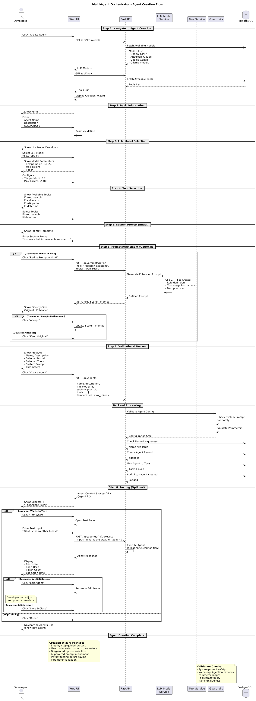
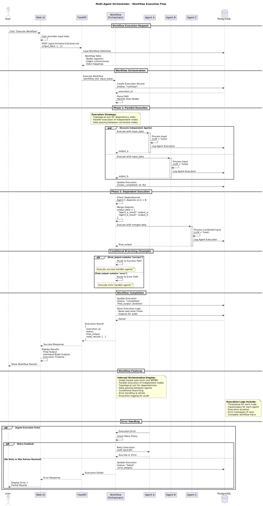

# 📘 Multi-Agent Orchestrator - User Guide

Welcome to the Multi-Agent Orchestrator User Guide! This document will walk you through the core features of the platform, from setting up AI models to creating complex agent workflows.

---

## 📚 Table of Contents
1. [Managing AI Models](#1-managing-ai-models)
2. [Creating Agents](#2-creating-agents)
3. [Knowledge Base (RAG)](#3-knowledge-base-rag)
4. [Building Workflows](#4-building-workflows)
5. [API Usage](#5-api-usage)

---

## 1. Managing AI Models

The platform supports a variety of LLM providers including OpenAI, Anthropic, Gemini, Azure, and local Ollama models.

### ☁️ Cloud Providers
To use cloud models like GPT-4 or Claude 3.5 Sonnet:
1. Navigate to the **Models** workspace.
2. Click **Add Model**.
3. Select the provider (e.g., `OpenAI`).
4. Enter your **API Key** and the **Model Name** (e.g., `gpt-4-turbo`).
5. Click **Save**.

### 🦙 Local Models (Ollama)
The platform automatically discovers models running in your local Ollama instance.
1. Ensure Ollama is running (`ollama serve`).
2. Pull a model locally:
   ```bash
   ollama pull llama3:8b
   ```
3. In the platform, go to **Models** > **Discovered Models**.
4. You should see `llama3:8b` listed. Click **Import** to make it available for agents.

### 🧪 Model Playground
Test any configured model before using it:
1. Go to the **Models** workspace.
2. Click the **Test** (flask) icon on a model card.
3. Enter a prompt and verify the response.

---

## 2. Creating Agents

Agents are the autonomous workers that execute tasks.



1. Navigate to the **Agents** workspace.
2. Click **+ New Agent**.
3. **Identity**: Give your agent a Name and Description (e.g., "Python Helper").
4. **Model**: Select the LLM that powers this agent (e.g., `gpt-4` or `llama3`).
5. **System Prompt**: Define the agent's persona and rules.
   > *Example: "You are an expert Python developer. Always provide code with type hints."*
6. **Capabilities**:
   - Toggle **Knowledge Base Retrieval** to allow RAG access.
   - Toggle **Code Interpreter** for executing Python code.
7. **Tools**: Select tools the agent can use (e.g., `web_search`, `calculator`).
8. Click **Create Agent**.

---

## 3. Knowledge Base (RAG)

Give your agents access to custom data (PDFs, websites) using Retrieval-Augmented Generation (RAG).

### 📥 Adding Sources
1. Go to the **Knowledge Base** workspace.
2. **Websites**:
   - Click the **Website** tab.
   - Enter a name and URL (e.g., "Company Docs", `https://docs.example.com`).
   - Click **Add Source**.
3. **PDFs**:
   - Click the **PDF** tab.
   - Drag and drop a PDF file.
   - Click **Upload**.

The system will automatically scrape, chunk, and embed the content.

### 🔗 Assigning Sources to Agents
By default, an agent with RAG enabled searches **all** your sources. To restrict access:
1. Go to the **Agents** workspace and select an agent.
2. Click the **Knowledge Base** tab (book icon).
3. Check the specific sources this agent should access.
4. Unchecked sources will be ignored during that agent's execution.

---

## 4. Building Workflows

Orchestrate multiple agents to solve complex problems.



1. Navigate to the **Chains** workspace.
2. Click **+ New Chain**.
3. **Visual Editor**:
   - Drag **Agent Nodes** from the sidebar onto the canvas.
   - Select an agent for each node.
   - Connect nodes by dragging wires between handles.
4. **Logic**:
   - Use **Router Nodes** for conditional logic (e.g., "If sentiment is negative, route to Support Agent").
   - Use **Parallel Nodes** to run agents simultaneously.
5. **Testing**:
   - Click the **Play** button.
   - Enter an initial input.
   - Watch the execution flow in real-time.

---

## 5. API Usage

Execute workflows programmatically from your own applications.

### 🔑 Authentication
All API requests require an API Key.
1. Go to **Settings** > **API Keys**.
2. Generate a new key.

### 🚀 Triggering a Workflow
**Endpoint**: `POST /api/v1/chains/{chain_id}/execute`

```bash
curl -X POST http://localhost:8000/api/v1/chains/<YOUR_CHAIN_ID>/execute \
  -H "Authorization: Bearer <YOUR_API_KEY>" \
  -H "Content-Type: application/json" \
  -d '{
    "input": {
      "message": "Analyze this quarterly report..."
    }
  }'
```

### 📡 Polling Status
The execution runs asynchronously. Use the returned `execution_id` to check status.

**Endpoint**: `GET /api/v1/executions/{execution_id}`

```bash
curl http://localhost:8000/api/v1/executions/<EXECUTION_ID> \
  -H "Authorization: Bearer <YOUR_API_KEY>"
```

Response:
```json
{
  "status": "completed",
  "result": {
    "output": "The quarterly report shows a 15% growth..."
  }
}
```

---

_Need more help? Check the [README](../README.md) for deployment instructions._
