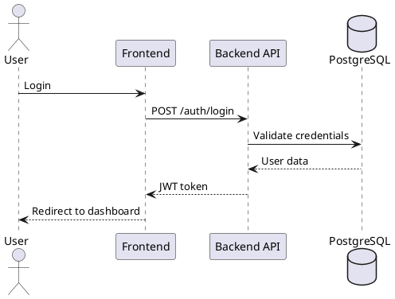

# PlantUML Diagrams

This directory contains PlantUML diagrams that visualize the architecture, flows, and processes of the Multi-Agent Orchestrator platform.

## Viewing Diagrams

### Option 1: VS Code (Recommended)
Install the [PlantUML extension](https://marketplace.visualstudio.com/items?itemName=jebbs.plantuml) for VS Code:
1. Install the extension
2. Open any `.puml` file
3. Press `Alt+D` to preview the diagram

### Option 2: Online Viewer
Visit [PlantUML Online Server](http://www.plantuml.com/plantuml/uml/) and paste the diagram code.

### Option 3: Export to PNG/SVG

#### Recommended: Using Make (Docker-based)
```bash
# Generate all diagrams as PNG files
make diagrams
```

#### Alternative: Using PlantUML CLI (requires PlantUML installation)
```bash
# Export to PNG
plantuml -tpng diagram.puml

# Export to SVG (recommended for documentation)
plantuml -tsvg diagram.puml
```

#### Alternative: Using the batch script
```bash
# Windows
.\scripts\generate-diagrams.bat
```

## Diagram Categories

### Architecture Diagrams
- **architecture-overview.puml** - Overall system architecture with all major components
- **architecture-microservices.puml** - Detailed microservices architecture and communication
- **architecture-security.puml** - Security architecture (Keycloak, Casbin RBAC, API Gateway)

### Code Flow Diagrams
- **flow-agent-execution.puml** - Agent execution sequence diagram
- **flow-workflow-orchestration.puml** - Workflow/chain orchestration flow
- **flow-authentication.puml** - Authentication and authorization flow
- **flow-llm-provider.puml** - LLM provider integration flow

### User Flow Diagrams
- **user-flow-registration.puml** - User registration and onboarding
- **user-flow-agent-creation.puml** - Agent creation wizard flow
- **user-flow-workflow-creation.puml** - Workflow/chain creation flow
- **user-flow-model-management.puml** - LLM model management flow

### Data Flow Diagrams
- **data-flow-request-response.puml** - End-to-end data flow
- **data-flow-llm-interaction.puml** - LLM request/response data flow
- **data-flow-memory-embeddings.puml** - Memory and embedding system flow
- **data-flow-guardrails.puml** - Guardrails validation flow

## Editing Diagrams

PlantUML uses a simple text-based syntax. Here are some basics:



### Common Elements
- `actor` - Human users
- `participant` - System components
- `database` - Databases
- `->` - Synchronous call
- `-->` - Return/response
- `->>` - Asynchronous call
- `note right/left of` - Add notes
- `alt/else/end` - Conditional logic
- `loop/end` - Loops

## Resources
- [PlantUML Documentation](https://plantuml.com/)
- [Sequence Diagram Syntax](https://plantuml.com/sequence-diagram)
- [Component Diagram Syntax](https://plantuml.com/component-diagram)
- [Deployment Diagram Syntax](https://plantuml.com/deployment-diagram)
